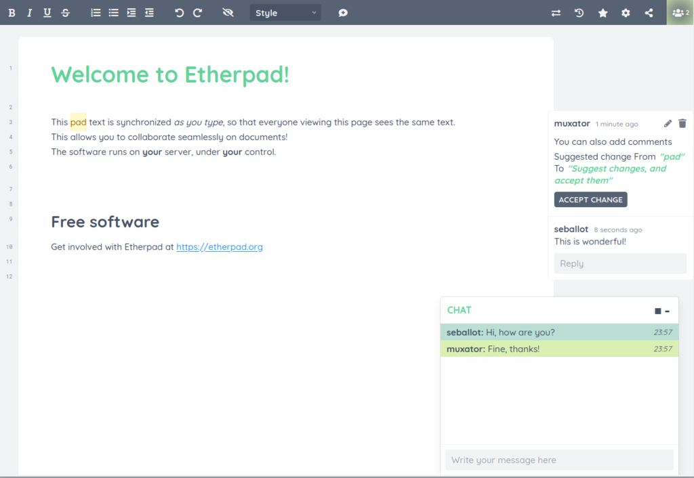

<!--
NB: Deze README is automatisch gegenereerd door <https://github.com/YunoHost/apps/tree/master/tools/readme_generator>
Hij mag NIET handmatig aangepast worden.
-->

# Etherpad voor Yunohost

[](https://ci-apps.yunohost.org/ci/apps/etherpad/)  

[](https://install-app.yunohost.org/?app=etherpad)

*[Deze README in een andere taal lezen.](./ALL_README.md)*

> *Met dit pakket kun je Etherpad snel en eenvoudig op een YunoHost-server installeren.*  
> *Als je nog geen YunoHost hebt, lees dan [de installatiehandleiding](https://yunohost.org/install), om te zien hoe je 'm installeert.*

## Overzicht

Etherpad is a real-time collaborative editor scalable to thousands of simultaneous real time users. It provides full data export capabilities, and runs on your server, under your control.
This version of Etherpad is installed without plugins and uses Rustydb as database.
If you want to install Etherpad with plugins and MySQL database: https://github.com/YunoHost-Apps/etherpad_mypads_ynh


**Geleverde versie:** 2.2.6~ynh1

**Demo:** <https://video.etherpad.com/>

## Schermafdrukken



## Documentatie en bronnen

- Officiele website van de app: <https://etherpad.org/>
- Officiele beheerdersdocumentatie: <https://etherpad.org/doc/v2.0.2/>
- Upstream app codedepot: <https://github.com/ether/etherpad-lite>
- YunoHost-store: <https://apps.yunohost.org/app/etherpad>
- Meld een bug: <https://github.com/YunoHost-Apps/etherpad_ynh/issues>

## Ontwikkelaarsinformatie

Stuur je pull request alsjeblieft naar de [`testing`-branch](https://github.com/YunoHost-Apps/etherpad_ynh/tree/testing).

Om de `testing`-branch uit te proberen, ga als volgt te werk:

```bash
sudo yunohost app install https://github.com/YunoHost-Apps/etherpad_ynh/tree/testing --debug
of
sudo yunohost app upgrade etherpad -u https://github.com/YunoHost-Apps/etherpad_ynh/tree/testing --debug
```

**Verdere informatie over app-packaging:** <https://yunohost.org/packaging_apps>
